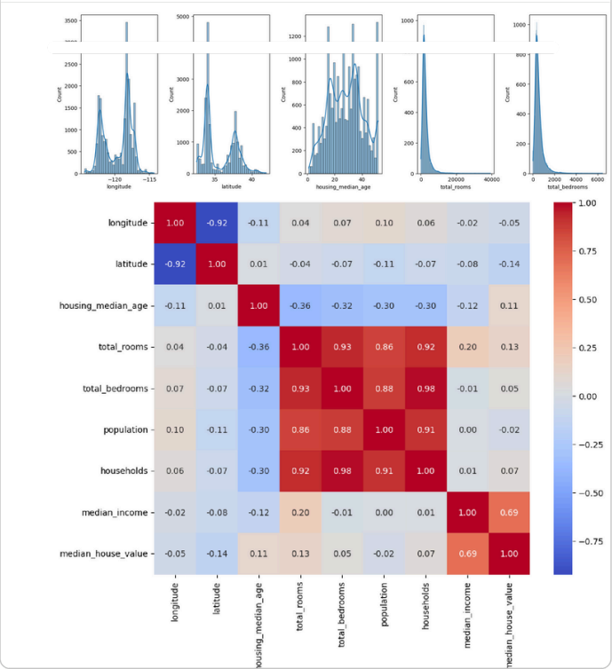
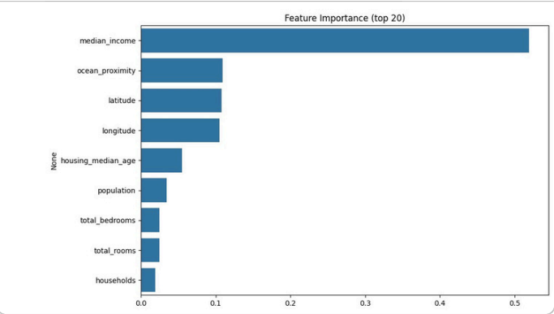
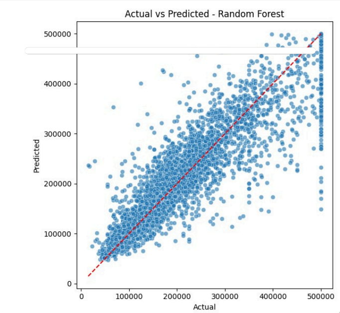
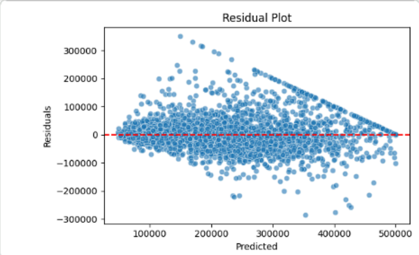

# House-Price-Prediction-ML

Academic team project developed for the Introduction to Data Science course at Jazan University.

## Project Overview

This project focuses on predicting house prices using machine learning and data analysis techniques. The workflow includes data cleaning, exploratory data analysis (EDA), feature engineering, regression models, and model evaluation.

## Tools & Technologies

* Python
* Pandas
* NumPy
* Matplotlib
* Seaborn
* Scikit-learn

## Machine Learning Models

* Linear Regression
* Random Forest Regressor

## Project Features

* Data preprocessing and cleaning
* Correlation heatmap visualization
* Model comparison using RMSE, MAE, and R²
* Feature importance analysis
* House price prediction

## Visualizations & Results

### Correlation Heatmap

---

### Feature Importance

---

### Actual vs Predicted

---

### Residual Plot

## Files Included

* House_Price_Prediction_Report.pdf
* heatmap.png
* feature_importance.png
* actual_vs_predicted.png
* residual_plot.png

## Note

This repository contains an academic team project completed collaboratively as part of a university coursework assignment.
